# MVP — Engenharia de Dados

**Pipeline de dados na nuvem para análise da matriz elétrica brasileira (2019–2025)**

Pós-graduação em Ciência de Dados e Analytics — PUC-Rio
Sprint 3: Engenharia de Dados
Autor: Raphael Matias Brandão Montenário

---

## Sumário

- [Contexto de Negócio e Perguntas (Etapas 2 e 4.1)](#contexto-de-negócio-e-perguntas-etapas-2-e-41)
- [Carga dos Dados (Etapa 4.2)](#carga-dos-dados-etapa-42)
- [Modelagem e Catálogo de Dados (Etapa 4.3)](#modelagem-e-catálogo-de-dados-etapa-43)
- [Pipeline de Dados (Etapa 4.4)](#pipeline-de-dados-etapa-44)
- [Qualidade de Dados (Etapa 4.5)](#qualidade-de-dados-etapa-45)
- [Análise de Dados (Etapa 4.5)](#análise-de-dados-etapa-45)
- [Extensão — Capacidade Instalada e Fator de Capacidade](#extensão--capacidade-instalada-e-fator-de-capacidade)
- [Autoavaliação](#autoavaliação)

---

## Contexto de Negócio e Perguntas (Etapas 2 e 4.1)

### O problema

A matriz elétrica brasileira passou por uma transformação acelerada na última década. A entrada massiva de geração eólica e fotovoltaica alterou não apenas a composição das fontes, mas o próprio comportamento operacional do sistema: fontes intermitentes não podem ser despachadas sob demanda, o que muda como o operador equilibra oferta e carga ao longo do dia e desloca os fluxos de energia entre regiões.

Este MVP constrói um pipeline de dados de ponta a ponta para quantificar essa transformação a partir dos dados operativos oficiais do Operador Nacional do Sistema Elétrico (ONS), respondendo perguntas que um analista do setor faria antes de planejar expansão de geração ou de transmissão.

### Perguntas de negócio

1. Como evoluiu a participação de cada fonte (hidráulica, térmica, eólica, fotovoltaica) na matriz de geração, por subsistema, entre 2019 e 2025?
2. O crescimento da geração eólica e fotovoltaica reduziu a dependência de geração térmica?
3. Qual subsistema apresenta hoje a maior dependência de fontes intermitentes?
4. Como carga e geração se comportam ao longo do dia? Existe descasamento entre o pico de demanda e o pico de geração solar?
5. Quais subsistemas são exportadores ou importadores líquidos de energia, e essa posição mudou no período?

### Os dados brutos

| Item | Descrição |
|---|---|
| **Dataset** | Balanço de Energia nos Subsistemas (base horária) |
| **Fonte** | Portal de Dados Abertos do ONS — https://dados.ons.org.br/dataset/balanco-energia-subsistema |
| **Período adotado** | 2019 a 2025 (7 anos completos) |
| **Granularidade** | Hora × subsistema |
| **Volume** | 7 arquivos CSV, ~31 MB, 306.840 registros |
| **Atualização na fonte** | Diária |

Estrutura dos arquivos brutos, conforme o dicionário de dados oficial do ONS:

| Coluna | Tipo | Unidade | Descrição |
|---|---|---|---|
| `id_subsistema` | texto | — | Código do subsistema |
| `nom_subsistema` | texto | — | Nome por extenso |
| `din_instante` | datetime | — | Data e hora da medição (horário de Brasília) |
| `val_gerhidraulica` | float | MWmed | Geração hidráulica verificada |
| `val_gertermica` | float | MWmed | Geração térmica verificada |
| `val_gereolica` | float | MWmed | Geração eólica verificada |
| `val_gersolar` | float | MWmed | Geração fotovoltaica verificada |
| `val_carga` | float | MWmed | Carga de energia verificada |
| `val_intercambio` | float | MWmed | Intercâmbio líquido de energia |

Os arquivos contêm **cinco** valores de `id_subsistema`: os quatro subsistemas reais (`NE`, `N`, `S`, `SE`) e um quinto registro `SIN` (Sistema Interligado Nacional), que é a **soma agregada dos quatro**. O tratamento dado a esse registro é descrito na seção de Modelagem.

### Licença de uso

Os dados são publicados sob licença **Creative Commons Attribution (CC-BY)**, que permite uso, modificação, adaptação e redistribuição, inclusive comercial, mediante atribuição da fonte. A atribuição é feita neste documento e nos comentários das tabelas do catálogo. Os dados são fornecidos pelo ONS "como estão", para fins informativos.

---

## Carga dos Dados (Etapa 4.2)

A coleta é **automatizada por código**, não por upload manual. O notebook [`01 - Coleta Bronze`](notebooks/01_coleta_bronze.ipynb) baixa os sete arquivos CSV diretamente do bucket público do ONS na AWS e os grava em um **Volume do Unity Catalog** no Databricks.

Essa decisão é deliberada. Uma coleta manual não é reproduzível: incluir um novo ano exigiria repetir o processo à mão, e não haveria registro auditável de como os dados chegaram. Com a coleta em código, o próprio script versionado é a documentação do processo, qualquer pessoa reproduz o resultado, e incluir 2026 é alterar um número.

O laço de download é **idempotente**: arquivos já presentes no Volume são ignorados, permitindo reexecutar o notebook sem retrabalho — requisito prático em pipelines, que são reexecutados com frequência.

**Destino dos arquivos brutos:** `/Volumes/workspace/bronze/raw_ons/`

> A saída da ingestão — os sete arquivos baixados e persistidos no Volume, seguidos da inspeção das três primeiras linhas do arquivo bruto — está renderizada no próprio [`01_coleta_bronze.ipynb`](notebooks/01_coleta_bronze.ipynb).

### Descoberta na inspeção do formato

A página do dataset informa que os arquivos são delimitados por vírgula. A inspeção das primeiras linhas do arquivo mostrou que o delimitador real é **ponto e vírgula**. Se a documentação tivesse sido aceita sem verificação, o Spark carregaria todo o conteúdo em uma única coluna.

Também se observou que valores zero da geração fotovoltaica aparecem na origem em notação científica (`0E-8`), o que é tratado na camada Silver pela conversão de tipo.

---

## Modelagem e Catálogo de Dados (Etapa 4.3)

### Arquitetura em camadas

O pipeline segue a **Arquitetura Medalhão**, materializada como três schemas no Unity Catalog:

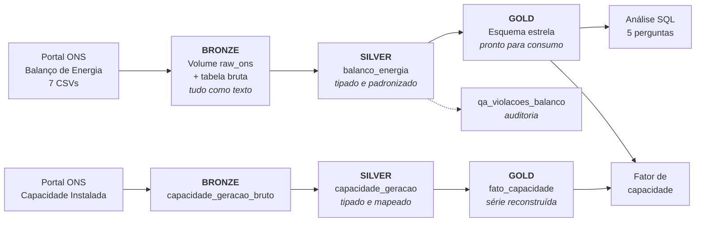

| Camada | Conteúdo | Transformações |
|---|---|---|
| **Bronze** | Arquivos originais no Volume + tabela Delta com todas as colunas como texto | Nenhuma alteração de conteúdo. Apenas metadados de linhagem: arquivo de origem e data de ingestão |
| **Silver** | Tabela tipada e padronizada | Conversão de texto para `timestamp` e `double`, remoção de espaços, marcação do registro agregado SIN |
| **Gold** | Esquema estrela com duas tabelas fato e três dimensões conformadas | Unipivot das fontes, exclusão do agregado SIN, geração de chaves substitutas, enriquecimento temporal |

A camada Bronze armazena **tudo como texto**, de forma deliberada. A camada é o registro fiel do que foi recebido; a tipagem é uma interpretação e, como tal, pertence à Silver. Isso garante que, se uma conversão se mostrar equivocada, o dado original permanece disponível sem necessidade de nova ingestão.

### Esquema estrela (camada Gold)

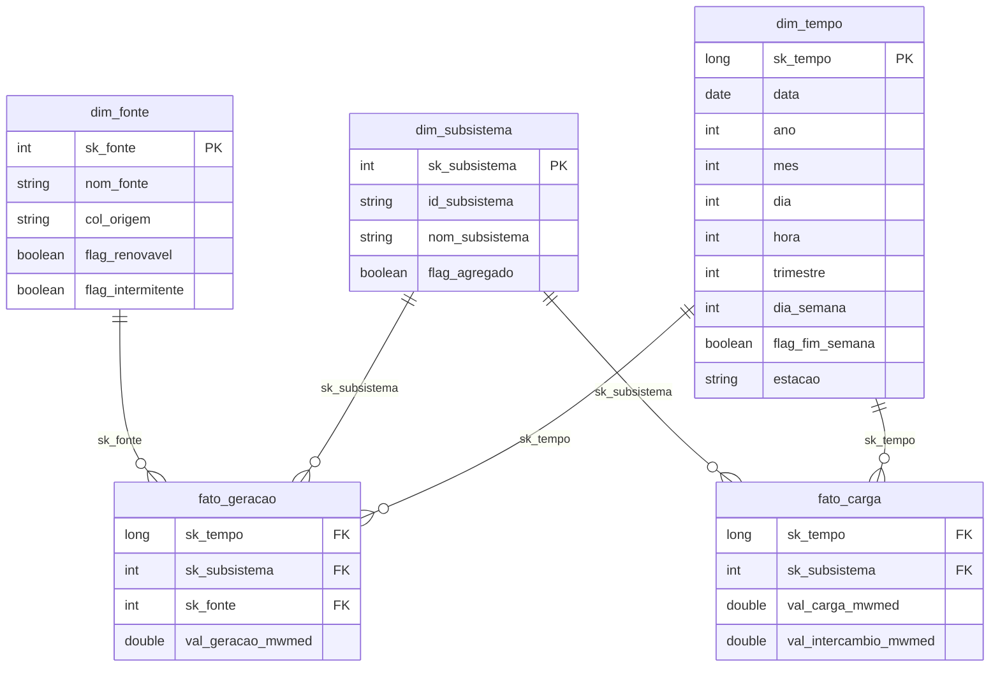

Duas tabelas fato compartilham as mesmas dimensões porque possuem **grãos diferentes**: a geração é medida por fonte, a carga não. Forçar as duas em uma única tabela exigiria repetir o valor de carga em cada linha de fonte, criando risco de dupla contagem em qualquer agregação. Dimensões conformadas permitem consultar as duas fatos em conjunto sem essa armadilha.

| Tabela | Grão | Registros |
|---|---|---|
| `fato_geracao` | hora × subsistema × fonte | 981.888 |
| `fato_carga` | hora × subsistema | 245.472 |
| `dim_tempo` | hora | 61.368 |
| `dim_subsistema` | subsistema | 5 |
| `dim_fonte` | fonte | 4 |

### Tratamento do registro agregado SIN

O registro `SIN` presente nos arquivos originais é a soma dos quatro subsistemas reais. Incluí-lo nas tabelas fato dobraria todos os totais.

A decisão adotada preserva a rastreabilidade sem criar risco: a **Silver mantém todos os registros**, marcados pela coluna `flag_agregado`, enquanto as **tabelas fato da Gold excluem o SIN**. Nenhum dado é descartado, e o registro agregado ainda cumpre uma função útil — serve como referência independente para validar os próprios cálculos do pipeline, conforme descrito na seção de Qualidade.

### Catálogo de dados

O catálogo foi implementado **dentro do Unity Catalog**, por meio de comandos `COMMENT ON TABLE` e `ALTER COLUMN ... COMMENT`, e não em documento separado. A documentação fica acoplada ao dado: quem abre a tabela no Catalog Explorer vê a descrição de cada campo, seu domínio de valores e sua origem, sem depender de um arquivo que pode desatualizar.

As **11 tabelas** do pipeline estão documentadas — 31 colunas na Bronze, 22 na Silver e 41 nas sete tabelas da Gold, somando 94 campos descritos. O notebook [`05 - Catálogo de Dados`](notebooks/05_catalogo_dados.ipynb) contém as definições completas.

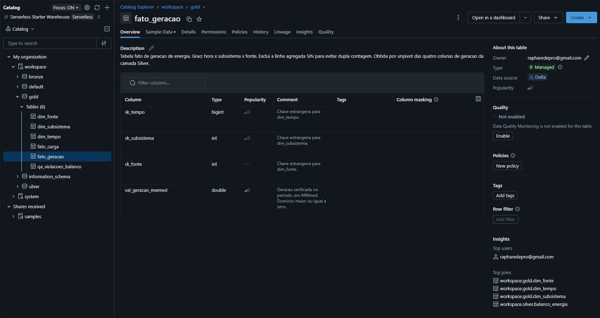
*Tabela `gold.fato_geracao`: descrição da tabela e comentário de cada campo, visíveis diretamente na plataforma.*

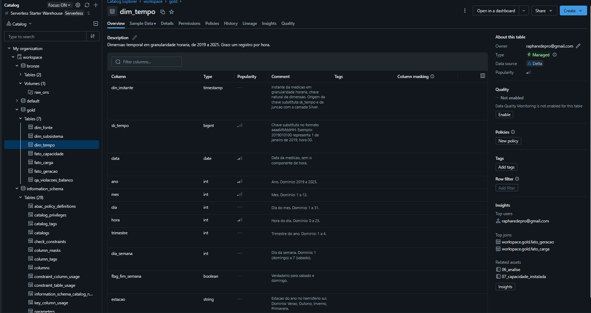
*Dimensão temporal, com domínio de valores declarado campo a campo.*

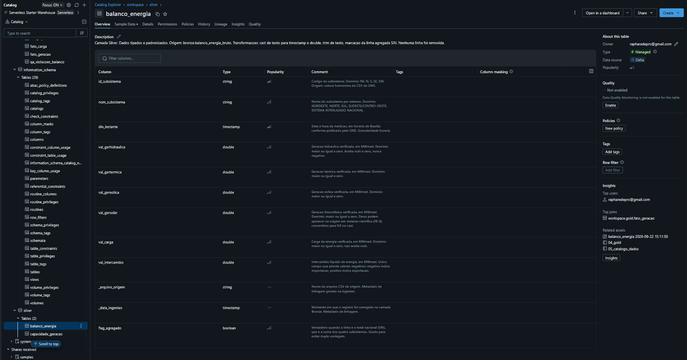
*Camada Silver, incluindo os metadados de linhagem `_arquivo_origem` e `_data_ingestao`.*

**Verificação da cobertura.** Documentar tabela por tabela está sujeito a esquecimento — durante a construção do projeto, colunas passaram despercebidas em três momentos distintos. A cobertura foi então verificada por consulta ao `information_schema`, o catálogo de metadados do próprio Unity Catalog, retornando qualquer coluna das três camadas sem comentário:

```sql
SELECT table_schema, table_name, column_name
FROM workspace.information_schema.columns
WHERE table_schema IN ('bronze', 'silver', 'gold')
  AND (comment IS NULL OR trim(comment) = '')
ORDER BY table_schema, table_name, ordinal_position;
```

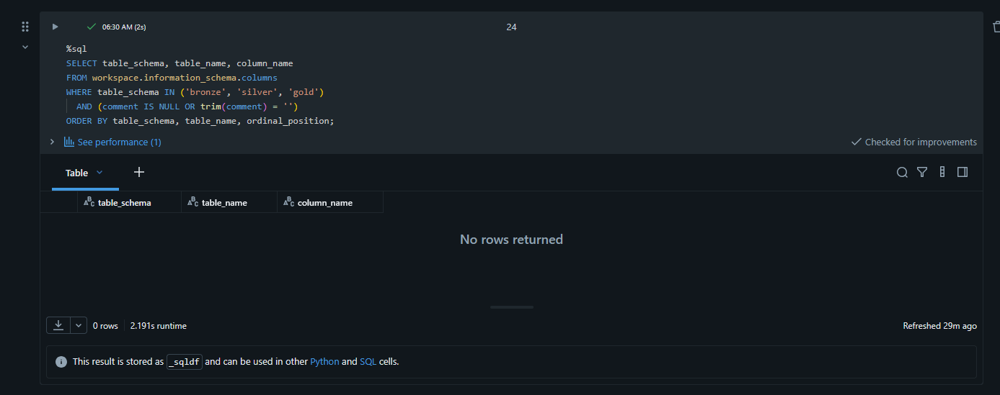
*Resultado vazio: nenhuma coluna sem documentação. A verificação é feita por consulta, não por inspeção visual.*

#### Catálogo transcrito — camada Gold

**`dim_subsistema`** — Dimensão de subsistemas do SIN. Grão: um registro por subsistema.

| Campo | Tipo | Descrição e domínio |
|---|---|---|
| `sk_subsistema` | int | Chave substituta. Inteiro sequencial |
| `id_subsistema` | string | Chave natural. Domínio: NE, N, S, SE, SIN |
| `nom_subsistema` | string | Nome por extenso do subsistema |
| `flag_agregado` | boolean | Verdadeiro apenas para SIN. As fatos excluem estes registros |

**`dim_fonte`** — Dimensão de fontes de geração. Construída a partir de conhecimento de domínio do setor elétrico.

| Campo | Tipo | Descrição e domínio |
|---|---|---|
| `sk_fonte` | int | Chave substituta. Domínio: 1 a 4 |
| `nom_fonte` | string | Domínio: Hidráulica, Térmica, Eólica, Fotovoltaica |
| `col_origem` | string | Coluna da Silver que originou a fonte após o unpivot. Metadado de linhagem |
| `flag_renovavel` | boolean | Verdadeiro para hidráulica, eólica e fotovoltaica |
| `flag_intermitente` | boolean | Verdadeiro para eólica e fotovoltaica |

**`dim_tempo`** — Dimensão temporal horária de 2019 a 2025. Grão: uma hora.

| Campo | Tipo | Descrição e domínio |
|---|---|---|
| `din_instante` | timestamp | Instante da medição em granularidade horária. Chave natural da dimensão e origem da `sk_tempo` |
| `sk_tempo` | long | Chave substituta no formato aaaaMMddHH |
| `data` | date | Data sem componente de hora |
| `ano` | int | Domínio: 2019 a 2025 |
| `mes` | int | Domínio: 1 a 12 |
| `dia` | int | Domínio: 1 a 31 |
| `hora` | int | Domínio: 0 a 23 |
| `trimestre` | int | Domínio: 1 a 4 |
| `dia_semana` | int | Domínio: 1 (domingo) a 7 (sábado) |
| `flag_fim_semana` | boolean | Verdadeiro para sábado e domingo |
| `estacao` | string | Hemisfério sul. Domínio: Verão, Outono, Inverno, Primavera |

**`fato_geracao`** — Grão: hora × subsistema × fonte. Exclui o agregado SIN.

| Campo | Tipo | Descrição e domínio |
|---|---|---|
| `sk_tempo` | long | Chave estrangeira para `dim_tempo` |
| `sk_subsistema` | int | Chave estrangeira para `dim_subsistema` |
| `sk_fonte` | int | Chave estrangeira para `dim_fonte` |
| `val_geracao_mwmed` | double | Geração verificada em MWmed. Domínio: ≥ 0 |

**`fato_carga`** — Grão: hora × subsistema. Exclui o agregado SIN.

| Campo | Tipo | Descrição e domínio |
|---|---|---|
| `sk_tempo` | long | Chave estrangeira para `dim_tempo` |
| `sk_subsistema` | int | Chave estrangeira para `dim_subsistema` |
| `val_carga_mwmed` | double | Carga verificada em MWmed. Domínio: ≥ 0, não aceita nulo |
| `val_intercambio_mwmed` | double | Intercâmbio líquido em MWmed. Positivo = exportação, negativo = importação |

**`qa_violacoes_balanco`** — Tabela de auditoria de qualidade. Registra instantes em que a identidade do balanço energético não se fecha. Descrita na seção de Qualidade de Dados.

#### Catálogo transcrito — tabelas da extensão

**`bronze.capacidade_geracao_bruto`** — Cadastro de unidades geradoras do ONS, preservado como texto. 5.686 registros, 18 colunas.

**`silver.capacidade_geracao`** — Cadastro tipado, com padding removido e tipo de usina mapeado para as fontes do Balanço.

| Campo | Tipo | Descrição e domínio |
|---|---|---|
| `id_subsistema` | string | Domínio: NE, N, S, SE, **PY**. O código PY corresponde à metade paraguaia de Itaipu e não existe no Balanço de Energia |
| `nom_usina` | string | Nome da usina |
| `nom_tipousina` | string | Domínio: HIDROELÉTRICA, TÉRMICA, EOLIELÉTRICA, FOTOVOLTAICA, NUCLEAR |
| `nom_fonte` | string | Tipo mapeado para o vocabulário do Balanço. NUCLEAR é agrupada em Térmica |
| `dat_entradaoperacao` | date | Data de liberação para operação comercial |
| `dat_desativacao` | date | Data de desativação. Nulo indica unidade ativa |
| `val_potenciaefetiva` | double | Potência nominal da unidade, em MW. Domínio: maior que zero |

**`gold.fato_capacidade`** — Capacidade instalada reconstruída. Grão: ano × subsistema × fonte.

| Campo | Tipo | Descrição e domínio |
|---|---|---|
| `ano` | long | Domínio: 2019 a 2025 |
| `id_subsistema` | string | Domínio: NE, N, S, SE, PY |
| `nom_fonte` | string | Domínio: Hidráulica, Térmica, Eólica, Fotovoltaica |
| `capacidade_mw` | double | Capacidade instalada em 30 de junho do ano, em MW |

---

## Pipeline de Dados (Etapa 4.4)

O pipeline foi organizado em **sete notebooks sequenciais** — seis do fluxo principal e um da extensão —, um por responsabilidade. A alternativa — um notebook único — dificultaria reexecutar apenas uma etapa e tornaria a leitura do processo mais confusa.

| Notebook | Responsabilidade | Entrada | Saída |
|---|---|---|---|
| [`01 - Coleta Bronze`](notebooks/01_coleta_bronze.ipynb) | Download dos CSVs da fonte | URLs do ONS | Volume `raw_ons` |
| [`02 - Tabela Bronze`](notebooks/02_tabela_bronze.ipynb) | Leitura e persistência do dado cru | Volume `raw_ons` | `bronze.balanco_energia_bruto` |
| [`03 - Silver`](notebooks/03_silver.ipynb) | Tipagem, padronização e validação | Bronze | `silver.balanco_energia` |
| [`04 - Gold`](notebooks/04_gold.ipynb) | Modelagem dimensional | Silver | 5 tabelas em `gold` |
| [`05 - Catálogo de Dados`](notebooks/05_catalogo_dados.ipynb) | Perfil e documentação | Todas | Comentários no Unity Catalog |
| [`06 - Análise`](notebooks/06_analise.ipynb) | Qualidade e resposta às perguntas | Gold | `gold.qa_violacoes_balanco` |
| [`07 - Capacidade Instalada`](notebooks/07_capacidade_instalada.ipynb) | Extensão: segundo dataset e fator de capacidade | Portal ONS + Gold | `gold.fato_capacidade` |

Todas as tabelas são persistidas em formato **Delta**, padrão do Databricks, que fornece transações ACID, controle de versão e *time travel*.

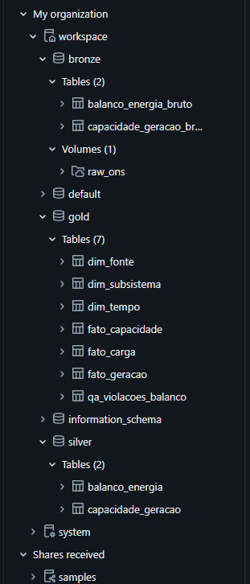
*Os três schemas da arquitetura medalhão no Unity Catalog, com o Volume de arquivos brutos sob a camada Bronze.*

### Linhagem

O Unity Catalog registra automaticamente toda leitura e escrita que passa por ele e monta o grafo de linhagem sem intervenção. Esse grafo não é documentação redigida à mão — que pode desatualizar em relação ao código — mas o que a plataforma **observou de fato acontecendo** no pipeline. Serve, portanto, como verificação independente de que o fluxo descrito neste documento é o fluxo executado.

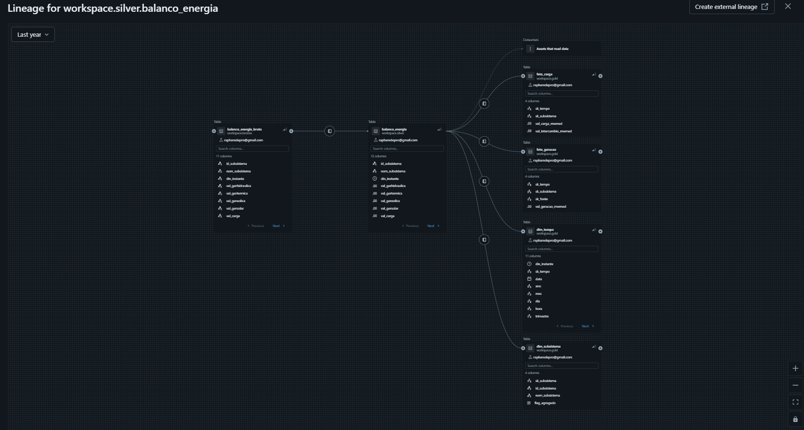
*Visão geral da propagação: `silver.balanco_energia` alimenta as quatro tabelas da camada Gold a partir de uma única origem. O detalhe de colunas aparece nos grafos individuais abaixo.*

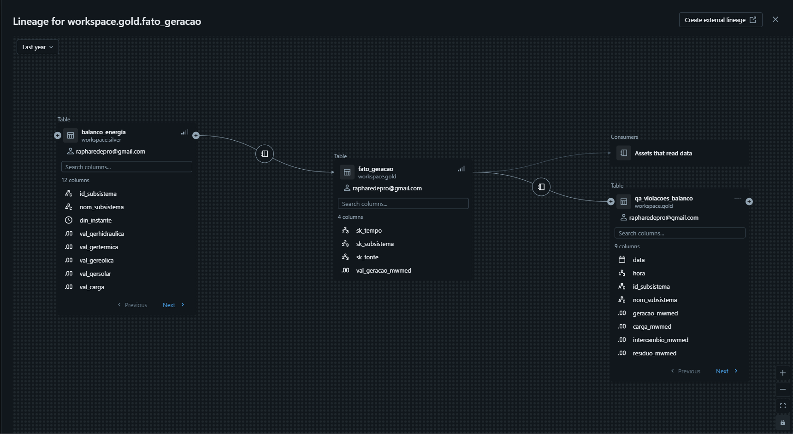
*Detalhe de `gold.fato_geracao`: origem na Silver e consumo pela tabela de auditoria de qualidade.*

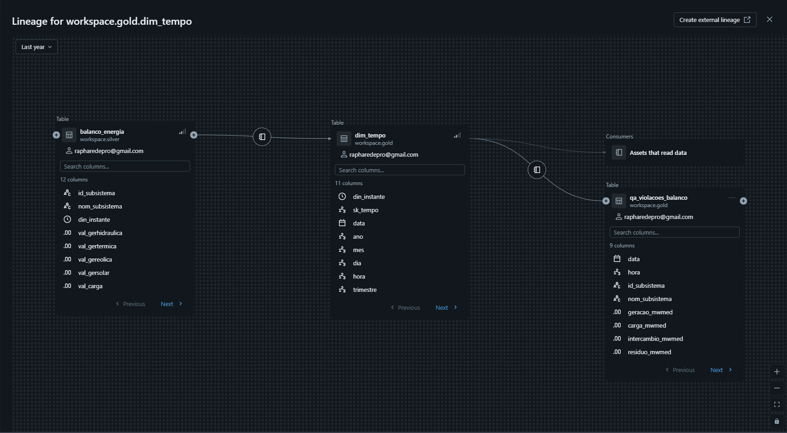
*Detalhe de `gold.dim_tempo`, derivada da mesma origem e consumida pelas tabelas fato.*

### Transformações aplicadas

**Bronze → Silver**

| Transformação | Motivo |
|---|---|
| `trim` nas colunas de texto, antes de qualquer regra | Eliminar espaços acidentais que quebrariam agrupamentos e a marcação do SIN |
| `din_instante` de texto para `timestamp` | Permitir extração de componentes temporais e ordenação correta |
| Seis colunas de valor de texto para `double` | Permitir agregação. Resolve também a notação `0E-8`, que representa zero |
| Criação de `flag_agregado`, sobre o texto já padronizado | Identificar o registro SIN sem removê-lo |
| Sessão Spark fixada em UTC | Convenção técnica para preservar exatamente a hora registrada no arquivo |

**Tratamento do fuso horário.** O campo `din_instante` é publicado sem informação explícita de fuso. Embora a referência seja o horário de Brasília, a série apresenta exatamente 24 observações por dia durante todo o período, inclusive no início de 2019, quando ainda vigorava o horário de verão no Brasil. Isso indica que os valores devem ser interpretados como uma grade horária nominal, sem aplicação das transições históricas de horário de verão. Por esse motivo, a sessão Spark é fixada em UTC exclusivamente como convenção técnica, para impedir conversões automáticas e preservar exatamente a hora registrada no arquivo. Assim, `00:00` continua sendo analisado como hora 00 da série do ONS; o valor não deve ser interpretado como um instante UTC real. Como a Pergunta 4 depende precisamente da hora do dia, qualquer deslocamento automático alteraria a conclusão sobre o descasamento entre carga e geração solar. Uma evolução futura seria armazenar `din_instante` como `TIMESTAMP_NTZ`, tipo que representa diretamente data e hora sem semântica de fuso horário.

**Silver → Gold**

| Transformação | Motivo |
|---|---|
| Unpivot das quatro colunas de geração (`stack`) | Converter formato largo em formato longo, adequado a uma tabela fato com dimensão de fonte |
| Filtro `flag_agregado = false` | Excluir o total nacional e evitar dupla contagem |
| Geração de chaves substitutas | Isolar as fatos de mudanças nas chaves naturais da origem |
| Enriquecimento temporal | Permitir análise por hora, estação, dia da semana sem cálculo repetido em cada consulta |

---

## Qualidade de Dados (Etapa 4.5)

A verificação de qualidade foi conduzida em três níveis: completude estrutural, conformidade com o dicionário da fonte e consistência física dos valores.

### Completude

A contagem de registros por arquivo foi comparada ao valor esperado — 5 registros por hora × 24 horas × número de dias do ano:

| Ano | Esperado | Encontrado | Situação |
|---|---|---|---|
| 2019 | 43.800 | 43.800 | Completo |
| 2020 (bissexto) | 43.920 | 43.920 | Completo |
| 2021 | 43.800 | 43.800 | Completo |
| 2022 | 43.800 | 43.800 | Completo |
| 2023 | 43.800 | 43.800 | Completo |
| 2024 (bissexto) | 43.920 | 43.920 | Completo |
| 2025 | 43.800 | 43.800 | Completo |
| **Total** | **306.840** | **306.840** | **Nenhuma hora faltante em 7 anos** |

Foi essa verificação que revelou a existência do registro agregado SIN: a contagem retornou cinco registros por hora, e não os quatro subsistemas esperados. Observa-se também que o tamanho dos arquivos varia entre anos sem relação com completude — tamanho de arquivo é um indicador inadequado, contagem de registros é o critério válido.

### Unicidade

A chave de negócio é a combinação subsistema + instante. Sobre 306.840 registros, foram encontradas 306.840 combinações distintas: **zero duplicatas**.

### Conformidade com o dicionário da fonte

As regras validadas não foram arbitradas, mas extraídas do dicionário de dados oficial do ONS, que especifica que as colunas de geração aceitam nulo e zero mas nunca valores negativos, que a carga não aceita nulo, e que o intercâmbio é o único campo que admite valores negativos.

| Regra verificada | Ocorrências |
|---|---|
| Geração hidráulica negativa | 0 |
| Geração térmica negativa | 0 |
| Geração eólica negativa | 0 |
| Geração fotovoltaica negativa | 0 |
| Carga nula | 0 |
| Carga negativa | 0 |
| Instante nulo | 0 |

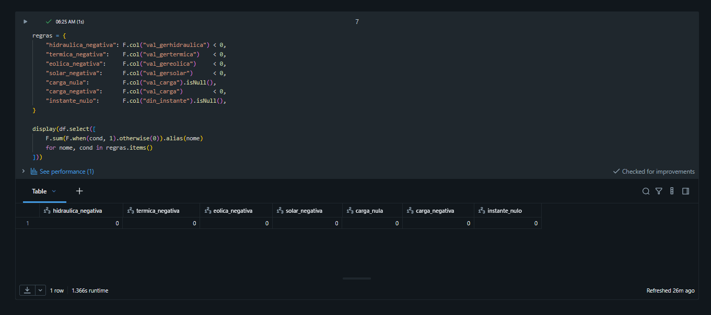
*Verificação de cada regra de domínio declarada no catálogo.*

**Verificação dos casts.** As regras de domínio não detectam um tipo de falha: um texto inválido na origem, por exemplo `"ERRO"`, que o cast não consegue converter. Dependendo da configuração do Spark, esse valor vira nulo sem gerar erro — e como as colunas de geração aceitam nulo pelo dicionário do ONS, ele passaria por todas as regras. O notebook 03 compara a Bronze com a conversão, usando `try_cast`, e conta os valores que existiam no texto original e se perderam no cast. O resultado foi zero em todas as sete colunas convertidas, e qualquer valor diferente de zero interrompe o pipeline antes da gravação da Silver.

### Consistência física: o balanço energético

Foi formulada e testada a hipótese de que, para cada subsistema em cada hora, deve valer a identidade:

```
geração = carga + intercâmbio
```

A hipótese surgiu da observação de um registro específico (Norte, 01/01/2019 às 00:00: geração 8.856,029 − carga 4.888,033 = 3.967,996, valor idêntico ao intercâmbio registrado). A verificação sobre a base completa mostrou que a identidade **se confirma em 245.448 dos 245.472 registros** e **falha em 24**.

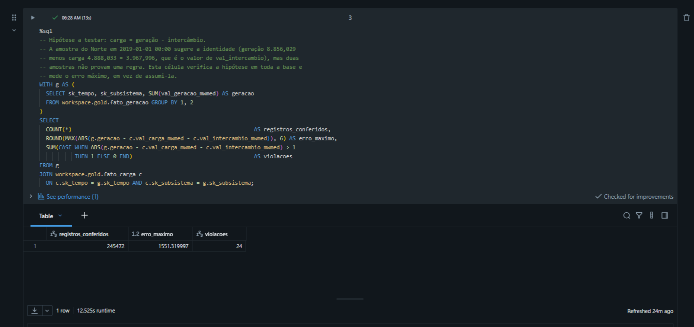
*245.472 registros verificados, erro máximo de 1.551 MWmed e 24 violações. A hipótese foi testada sobre toda a base, não inferida da amostra que a originou.*

Além de validar o pipeline, o teste fixou a semântica do sinal do intercâmbio, que o dicionário não explicita: **valores positivos indicam exportação e negativos indicam importação**. Sem essa determinação, a resposta à Pergunta 5 poderia sair com o sinal invertido.

### Anomalia detectada

As 24 violações apresentam um padrão claro: todas pertencem ao subsistema **Sul**, no dia **14/09/2022**, cobrindo as 24 horas do dia. O resíduo permanece entre −1.069 e −1.551 MWmed em todas as horas, enquanto a carga do dia varia entre 8.974 e 14.836 MWmed — ou seja, o déficit é praticamente constante enquanto a carga oscila 65%.

A investigação eliminou as causas mais prováveis:

| Hipótese | Verificação | Resultado |
|---|---|---|
| Erro do pipeline (join, filtro) | Violações estariam espalhadas pela base | Descartada: concentradas em 24 horas consecutivas de um único subsistema |
| Ruído de medição | Resíduo seria aleatório em sinal e magnitude | Descartada: déficit quase constante ao longo de 24 horas |
| Geração ausente no registro | Comparação de cada fonte com os dias 12 a 16/09 | Sem evidência de desaparecimento de nenhuma fonte: eólica, fotovoltaica, hidráulica e térmica em valores compatíveis com os dias vizinhos |
| Carga inflada | Comparação com dias vizinhos | Descartada: 12.033 MWmed contra faixa de 11.474 a 11.916 |

O campo que se desloca é o **intercâmbio**: 5.104 MWmed no dia 14 contra 2.362 a 2.937 nos dias imediatamente anteriores e posteriores. A janela de nove dias mostra resíduo exatamente zero em todos os demais dias.

Ainda assim, a causa raiz **não é determinável com os dados disponíveis**: tanto um intercâmbio superestimado quanto uma geração subnotificada em 1.317 MWmed explicariam o resíduo. O relatório registra o suspeito mais provável sem afirmar conclusão que os dados não sustentam.

**Impacto:** 24 registros em 245.472, ou 0,0098% da base, concentrados em um dia de 2.557. A discrepância equivale a 31,6 GWh, contra 607,5 TWh gerados no país em 2022 — cerca de 0,005% do total anual. Nenhuma conclusão da análise é afetada.

**Decisão:** os registros são **mantidos sem alteração**. Corrigir dado oficial sem conhecer a causa significaria inventar valores; removê-los quebraria a completude comprovada da série. A anomalia é registrada na tabela de auditoria `gold.qa_violacoes_balanco`, que preserva os valores originais, o resíduo medido e a data da verificação.

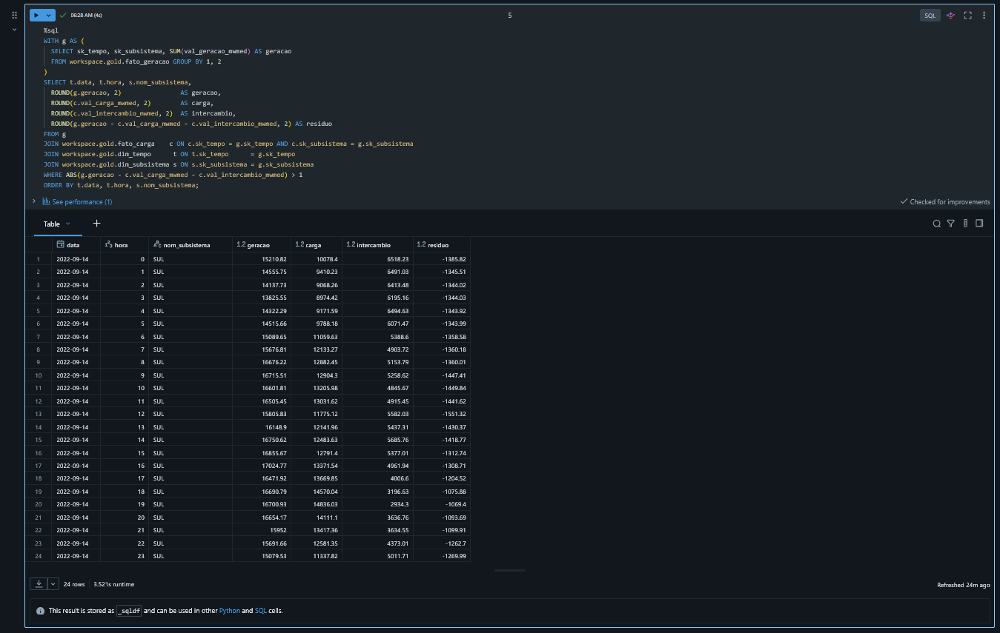
*As 24 violações da identidade do balanço, todas no subsistema Sul e no mesmo dia.*

### Validação cruzada do pipeline

O registro agregado SIN, excluído das tabelas fato, é reaproveitado como **referência independente de corretude**. A soma da geração dos quatro subsistemas foi comparada ao total nacional publicado pelo ONS para cada uma das 61.368 horas da série:

| Métrica | Resultado |
|---|---|
| Instantes comparados | 61.368 |
| Diferença máxima | 0,0034 MWmed |
| Instantes com diferença superior a 1 MWmed | 0 |

A diferença residual de 0,0034 MWmed corresponde ao acúmulo de erro de ponto flutuante na soma de quase um milhão de valores decimais — a ordem de grandeza esperada, e não um erro de lógica. O resultado confirma que o unpivot, os filtros e os joins do pipeline preservam integralmente os valores da fonte.

> A saída desta verificação está renderizada no próprio [`04_gold.ipynb`](notebooks/04_gold.ipynb).

### Contrato de dados

A verificação de balanço foi convertida em **regra permanente do pipeline**. O contrato verifica **quais** são as violações, e não apenas quantas: uma contagem igual poderia esconder a troca de uma violação antiga por uma nova. A execução é interrompida se surgir qualquer violação fora da anomalia documentada, ou se a própria anomalia documentada mudar — sinal de que a fonte revisou os dados:

```python
viol = spark.table("workspace.gold.qa_violacoes_balanco")
e_conhecida = ((F.col("id_subsistema") == "S")
               & (F.col("data") == F.to_date(F.lit("2022-09-14"))))

conhecidas = viol.filter(e_conhecida).count()
n_novas = viol.filter(~e_conhecida).count()

if n_novas > 0:
    raise ValueError(f"{n_novas} violações novas, fora da anomalia documentada.")
if conhecidas != 24:
    raise ValueError(f"A anomalia documentada mudou: {conhecidas} violações em vez de 24.")
```

A diferença prática é relevante: uma verificação pontual informa o estado atual, enquanto o contrato de dados impede que uma carga futura seja considerada aprovada para consumo sem investigação caso surja uma anomalia nova ou a anomalia conhecida mude.

---

## Análise de Dados (Etapa 4.5)

### Pergunta 1 — Evolução da matriz de geração por subsistema

**Composição da matriz nacional:**

| Fonte | 2019 | 2025 | Variação em participação |
|---|---|---|---|
| Hidráulica | 409,7 TWh (72,5%) | 403,8 TWh (57,7%) | −14,8 p.p. |
| Térmica | 97,6 TWh (17,3%) | 89,4 TWh (12,8%) | −4,5 p.p. |
| Eólica | 53,4 TWh (9,4%) | 115,4 TWh (16,5%) | +7,1 p.p. |
| Fotovoltaica | 4,4 TWh (0,8%) | 91,8 TWh (13,1%) | +12,3 p.p. |
| **Total** | **565,1 TWh** | **700,4 TWh** | **+23,9%** |

A geração fotovoltaica multiplicou-se por **21** no período; a eólica mais que dobrou. A hidráulica permaneceu estável em valor absoluto, o que significa que toda a expansão da matriz veio de fontes renováveis não hidráulicas.

> **Ressalva acrescentada após a extensão.** O fator de 21 vezes reflete fielmente o que o ONS publica, mas não corresponde a crescimento físico puro. A análise de capacidade instalada (seção Extensão) identificou uma quebra estrutural no Balanço de Energia em **maio de 2023**, compatível com alteração de escopo ou de metodologia, a partir da qual a geração fotovoltaica registrada passou a incluir uma parcela que antes não constava. Parte do salto é expansão real do parque e parte é ampliação do escopo contábil. O crescimento da eólica, verificado pelo mesmo método, não apresenta essa descontinuidade.

O caso do **Nordeste** é o mais acentuado. O subsistema já entrou no período com perfil atípico — em 2019 a eólica sozinha respondia por 52,4% de sua geração. Em 2025, eólica e solar somam 79,5%, a hidráulica caiu para 16,5% e a térmica recuou de 19,9% para 3,9%. Em sete anos o Nordeste deixou de ser um sistema hidrotérmico e passou a ser um sistema eólico-solar.

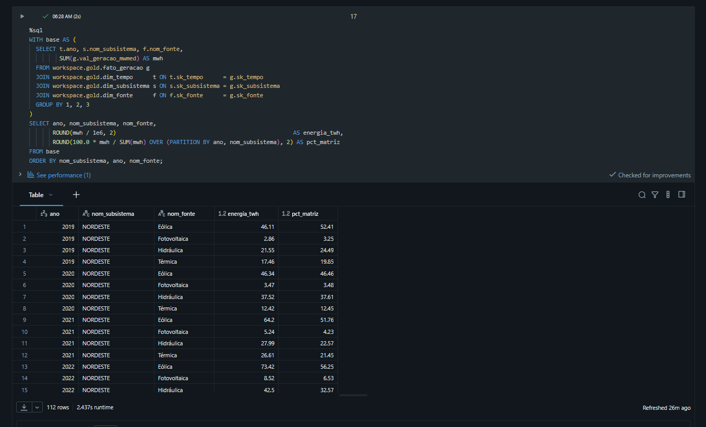

### Pergunta 2 — As renováveis reduziram a dependência térmica?

A resposta depende de distinguir valor absoluto de participação, e essa distinção é o ponto central.

Em valor absoluto a geração térmica recuou pouco: de 97,6 TWh em 2019 para 89,4 TWh em 2025, queda de 8,4%. Em participação, porém, caiu de 17,3% para 12,8%, porque a geração total cresceu 135,3 TWh no período.

A decomposição do crescimento fecha com precisão:

| Componente | TWh |
|---|---|
| Crescimento de eólica e fotovoltaica | +149,4 |
| Crescimento da demanda total | −135,3 |
| **Geração deslocada de outras fontes** | **14,1** |
| — deslocada da térmica | 8,2 |
| — deslocada da hidráulica | 5,9 |

As fontes intermitentes absorveram integralmente o crescimento da demanda e ainda deslocaram 14,1 TWh de geração preexistente.

O ano de **2021** demonstra o papel que a térmica ainda desempenha. A geração hidráulica caiu para 372,7 TWh, o menor valor da série, enquanto a térmica saltou para 141,9 TWh — 57% acima da média do período. É a crise hídrica de 2021 registrada no dado operativo, e evidencia que a térmica, apesar da participação declinante, permanece como seguro do sistema contra falha hidrológica.

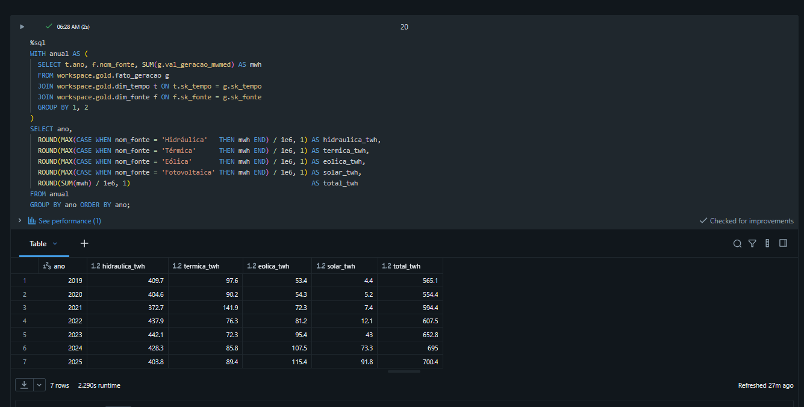

### Pergunta 3 — Dependência de fontes intermitentes (2025)

| Subsistema | Intermitentes | Renováveis |
|---|---|---|
| Nordeste | 79,5% | 96,1% |
| Sul | 17,6% | 90,6% |
| Sudeste/Centro-Oeste | 13,8% | 83,8% |
| Norte | 7,6% | 79,9% |

O Nordeste está em outro patamar: quase 80% de sua geração depende de recursos que variam no instante, sem possibilidade de despacho. Isso o torna o subsistema com a matriz mais limpa do país e, simultaneamente, o mais exposto à variabilidade de curto prazo — o que explica sua necessidade estrutural de forte interligação com os demais subsistemas.

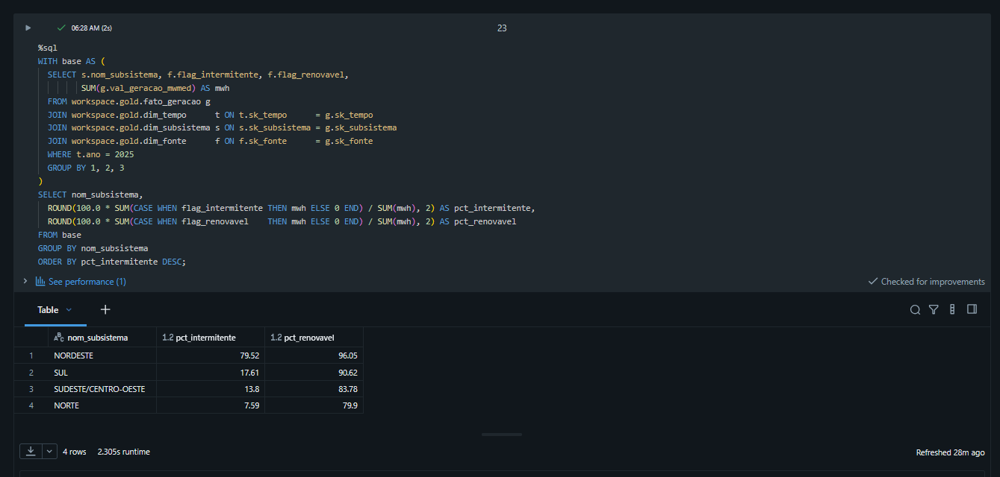

### Pergunta 4 — Descasamento diário entre carga e geração solar

Perfil médio horário nacional em 2025 (MWmed):

| Hora | Carga | Solar | Eólica | Térmica | Hidráulica |
|---|---|---|---|---|---|
| 04 | 68.658 | 22 | 16.515 | 10.242 | 42.161 |
| 11 | 82.160 | **31.430** | 7.253 | 9.824 | 34.010 |
| 12 | 80.598 | 31.118 | **6.737** | 9.819 | **33.306** |
| 19 | **89.975** | 21 | 15.532 | 10.521 | **64.278** |
| 23 | 80.016 | 5 | 17.183 | 10.500 | 52.722 |

**O pico de carga ocorre às 19h (89.975 MWmed); o pico solar ocorre às 11h (31.430 MWmed).** São oito horas de defasagem. No instante de maior demanda do sistema, a geração fotovoltaica entrega 21 MWmed — 0,02% da carga. No pico solar, por outro lado, ela cobre 38% de toda a carga nacional.

Três observações complementam o quadro:

**A eólica compensa parcialmente.** Sua curva é anticorrelata à solar: 17.233 MWmed à meia-noite contra 6.737 ao meio-dia, variação de 2,6 vezes. O regime de ventos brasileiro é mais intenso no período noturno, o que suaviza o descasamento — característica favorável que não se verifica em todas as matrizes.

**A hidráulica é quem equilibra o sistema.** Sua geração cai para 33.306 MWmed no pico solar e sobe para 64.278 MWmed às 19h: uma rampa de aproximadamente 31.000 MWmed em sete horas, quase dobrando a produção. É a hidráulica que absorve a entrada e a saída da solar ao longo do dia.

**A térmica opera como base, não como flexibilidade.** Sua geração varia apenas 7% ao longo das 24 horas, entre 9.819 e 10.552 MWmed. Não é ela quem acompanha a variação da carga.

A implicação operacional é que o Brasil utiliza seus reservatórios hidrelétricos para desempenhar a função que outros sistemas atribuem a baterias e usinas de partida rápida. Trata-se de uma vantagem estrutural da matriz brasileira e, ao mesmo tempo, de uma dependência: a capacidade de integrar mais geração fotovoltaica está vinculada à disponibilidade hidrológica dos reservatórios.

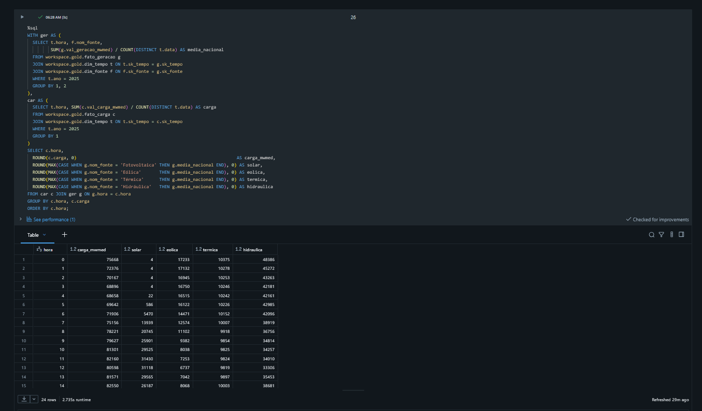

### Pergunta 5 — Posição líquida de exportação e importação

Intercâmbio líquido médio por subsistema (MWmed; positivo = exportador):

| Subsistema | 2019 | 2021 | 2023 | 2025 | Trajetória |
|---|---|---|---|---|---|
| Nordeste | −561 | +2.763 | +4.272 | **+6.264** | Importador → exportador |
| Norte | +3.957 | +5.298 | +2.667 | +2.169 | Exportador em declínio |
| Sudeste/Centro-Oeste | −1.664 | −5.193 | −5.107 | −5.640 | Importador crescente |
| Sul | −1.807 | −3.542 | −1.022 | −2.446 | Importador oscilante |

A mudança é estrutural. O Nordeste era **importador líquido** em 2019 e tornou-se exportador já em 2020, alcançando +6.264 MWmed em 2025 — onze vezes o déficit que apresentava no início da série. É a consequência direta da expansão eólica e solar documentada na Pergunta 1: o subsistema passou a gerar muito além da própria carga e exporta o excedente.

Na outra ponta, o Sudeste/Centro-Oeste, que concentra a maior carga do país, aprofundou sua posição importadora de −1.664 para −5.640 MWmed. O sentido histórico do fluxo de energia no Brasil se inverteu: hoje o Nordeste abastece o Sudeste.

Uma verificação adicional reforça a consistência do resultado: a soma dos quatro subsistemas em cada ano aproxima-se de zero (−75 MWmed em 2019, +347 MWmed em 2025), como esperado de um sistema fechado. O resíduo remanescente pode envolver perdas, convenções contábeis e arredondamentos; os dados disponíveis não permitem separá-los.

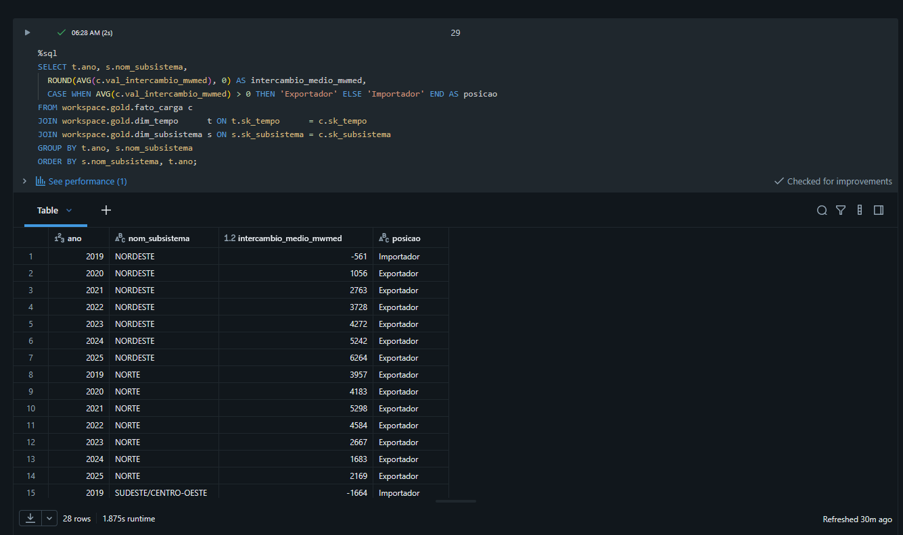

### Discussão geral

As cinco respostas convergem para um mesmo processo. A matriz elétrica brasileira não apenas incorporou fontes renováveis — ela **reorganizou sua geografia e sua dinâmica operacional**.

Na dimensão geográfica, a expansão eólica e solar concentrou-se no Nordeste, que deixou de ser deficitário e passou a abastecer o Sudeste, invertendo o sentido histórico dos fluxos e transferindo para a rede de transmissão uma função que antes era menos crítica.

Na dimensão temporal, a entrada da solar criou um descasamento diário de oito horas entre oferta e demanda, absorvido quase integralmente pela hidráulica por meio de rampas de 31 GW. A térmica, apesar de perder participação, permanece como seguro contra falha hidrológica — o que 2021 demonstrou de forma inequívoca.

A conclusão para quem planeja o sistema é que o limite para integrar mais geração intermitente no Brasil não está na capacidade de gerar, e sim na capacidade de **transportar** essa energia do Nordeste para os centros de carga e de **armazenar** flexibilidade para as horas em que o sol não está disponível. Ambas as restrições aparecem nos dados analisados.

---

## Extensão — Capacidade Instalada e Fator de Capacidade

A primeira versão deste trabalho registrou, como limitação, a ausência de dados de capacidade instalada — o que impedia distinguir "gerou mais porque instalou mais" de "gerou mais porque aproveitou melhor". O notebook [`07 - Capacidade Instalada`](notebooks/07_capacidade_instalada.ipynb) incorpora um segundo dataset do ONS para resolver essa limitação.

### O obstáculo e a solução

| Item | Descrição |
|---|---|
| **Dataset** | Capacidade Instalada de Geração |
| **Portal** | https://dados.ons.org.br/dataset/capacidade-geracao |
| **Licença** | Creative Commons Attribution (CC-BY) |
| **Granularidade** | Unidade geradora — mais fina que usina |
| **Volume** | 5.686 unidades |

O dataset **não possui série histórica**: é um retrato da situação atual, atualizado diariamente. À primeira vista isso inviabilizaria uma análise de sete anos.

A solução veio de dois campos do cadastro: `dat_entradaoperacao` e `dat_desativacao`. Com eles é possível **reconstruir a capacidade instalada em qualquer data passada**, somando as unidades que já haviam entrado em operação e ainda não tinham sido desativadas naquele momento. Implementado como um `crossJoin` entre os sete anos e as 5.686 unidades, com dois filtros decidindo a existência de cada unidade em cada ano.

A viabilidade do método foi confirmada por um indício encontrado na exploração: **980 das 1.469 unidades térmicas estão desativadas**, o que prova que o ONS preserva o histórico no cadastro em vez de removê-lo.

**Data de referência: 30 de junho.** Usar 31 de dezembro superestimaria os anos de expansão acelerada, contando como disponível o ano inteiro uma usina que entrou em dezembro.

### Tratamentos aplicados

| Problema encontrado | Tratamento |
|---|---|
| Arquivo de largura fixa disfarçado de CSV (`"NORDESTE            "`) | `trim` em todos os campos de texto, sob pena de junções falharem silenciosamente |
| Dicionário lista 19 campos, arquivo tem 18 (`id_ons` inexistente) | Schema declarado a partir do arquivo, não do manual |
| `NUCLEAR` é categoria própria, inexistente no Balanço | Mapeada para Térmica, coerente com a contabilização do ONS |
| Código de subsistema `PY` (metade paraguaia de Itaipu) | Excluído da comparação, por não existir no Balanço |

### Capacidade instalada reconstruída (GW)

Valores nacionais **sem a parcela paraguaia de Itaipu** (código `PY`), que existe no cadastro de capacidade mas não no Balanço de Energia. O mesmo recorte é usado no cálculo do fator de capacidade, para que numerador e denominador cubram o mesmo parque.

| Ano | Eólica | Solar | Hidráulica | Térmica |
|---|---|---|---|---|
| 2019 | 14,1 | 1,8 | 99,5 | 27,1 |
| 2022 | 20,9 | 4,5 | 102,5 | 30,5 |
| 2025 | 32,6 | 16,7 | 102,6 | 34,4 |

A eólica mais que dobrou, a solar cresceu nove vezes e a hidráulica cresceu apenas 3%, praticamente estagnada — a mesma história contada pela análise de geração, agora confirmada por um **dataset independente**.

### Fator de capacidade

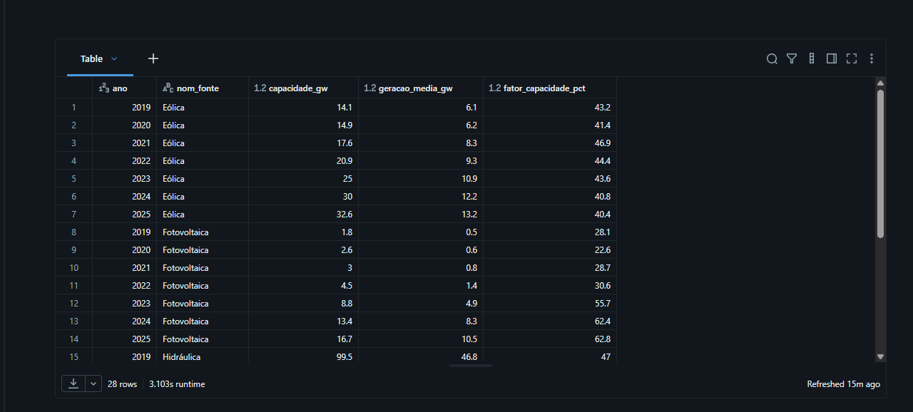
*Capacidade instalada reconstruída, geração média e fator de capacidade resultante, por fonte e ano.*

O indicador calculado é um **fator de capacidade anual aproximado**: usa a capacidade instalada em 30 de junho como proxy da capacidade média do ano. A aproximação é adequada para comparar fontes e anos, mas pode se afastar do valor exato em anos de expansão muito rápida.

| Fonte | Faixa observada | Avaliação |
|---|---|---|
| Hidráulica | 41,5 a 49,2% | Dentro do esperado para o Brasil |
| Eólica | 40,4 a 46,9% | Alto e estável, coerente com o regime de ventos do Nordeste |
| Térmica | 25,9 a 57,1% | Variação típica de fonte de complemento |
| **Fotovoltaica** | **22,6 a 62,8%** | **Fisicamente impossível a partir de 2023** |

Uma confirmação independente reforça o resultado: **2021 aparece nas duas pontas**. A hidráulica cai para 41,5%, o menor da série, e a térmica salta para 57,1%, o maior. A crise hídrica reaparece por um caminho distinto do usado na análise principal — lá por volume de energia, aqui por aproveitamento do parque instalado.

### A anomalia da fotovoltaica

| Ano | 2019 | 2020 | 2021 | 2022 | **2023** | 2024 | 2025 |
|---|---|---|---|---|---|---|---|
| FC | 28,1% | 22,6% | 28,7% | 30,6% | **55,7%** | 62,4% | 62,8% |

Um fator de capacidade de 62% em geração solar exigiria sol equivalente a 15 horas por dia, todos os dias do ano. E não se trata de desvio constante, que sugeriria erro de cálculo: é uma **quebra estrutural entre 2022 e 2023**.

A investigação da série mensal localizou o ponto exato:

| Mês | 2023-03 | 2023-04 | **2023-05** | 2023-06 |
|---|---|---|---|---|
| Geração média (MW) | 1.876 | 2.084 | **4.855** | 4.737 |

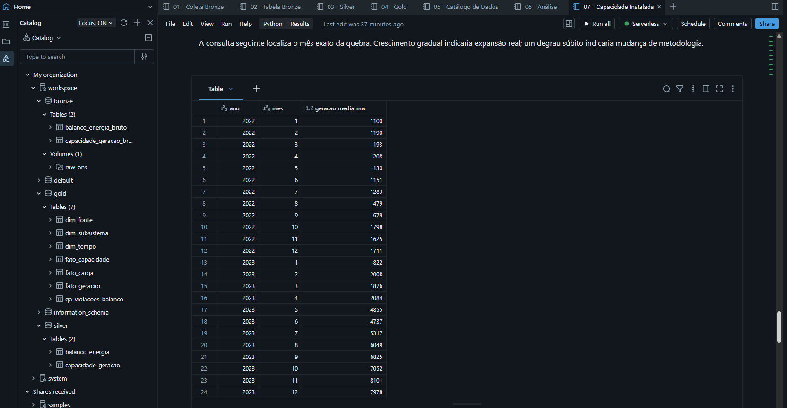
*A série mensal isola o degrau: crescimento gradual até abril de 2023, salto abrupto em maio.*

Nos dezesseis meses anteriores a série subiu de 1.100 para 2.084 MW, em crescimento gradual. Entre abril e maio de 2023 salta 2.771 MW em um único mês. Para ser expansão real, seria necessário instalar cerca de 9 GW de painéis em trinta dias — mais que dobrar todo o parque nacional, que naquele ano inteiro somava 8,8 GW.

**Conclusão: há uma quebra estrutural a partir de maio de 2023, compatível com alteração de escopo ou de metodologia.** A hipótese mais provável é a incorporação da micro e minigeração distribuída ao Balanço de Energia, sustentada pela descrição do dataset de capacidade, que cobre exclusivamente "unidades geradoras de usinas despachadas pelo ONS". O numerador passou a incluir uma parcela que o denominador nunca conteve.

O que o dado **prova** é a mudança e a sua data. A causa específica permanece como hipótese fundamentada.

### O que a extensão entregou

A limitação original foi resolvida para **três das quatro fontes**: hidráulica, eólica e térmica têm fator de capacidade calculado e interpretável em todo o recorte.

Para a fotovoltaica, o indicador é legível apenas até 2022 — e essa descoberta **qualifica uma conclusão da análise principal**, conforme ressalva registrada na Pergunta 1.

Uma extensão que apenas acrescenta uma métrica é útil. Uma que encontra um limite na análise anterior é mais valiosa, porque impede que um número correto seja interpretado de forma incorreta.

---

## Autoavaliação

### Atingimento dos objetivos

As cinco perguntas formuladas na etapa de objetivo foram respondidas com dados. O pipeline completo foi construído e opera de ponta a ponta na nuvem, da coleta automatizada na fonte até as consultas analíticas sobre o esquema estrela.

Mais relevante que o volume de código produzido foi a quantidade de decisões que os dados forçaram a rever. Três delas merecem registro.

A primeira foi a descoberta do registro agregado SIN. Ele não estava documentado como agregação e teria dobrado silenciosamente todos os totais do trabalho. Só apareceu porque a contagem de registros foi comparada a um valor esperado calculado antes de olhar o resultado. Se a verificação tivesse sido feita apenas para "conferir se carregou", o erro teria passado com aparência de correção — que é a forma mais perigosa de erro.

A segunda foi o fuso horário. O campo de data chega sem indicação de fuso, e o comportamento padrão do Spark depende da configuração do ambiente. Como a Pergunta 4 trata precisamente do horário do dia, um deslocamento de três horas teria invertido a conclusão sobre o descasamento entre carga e solar, e nada no resultado indicaria o problema.

A terceira foi a investigação da anomalia de balanço, e foi a mais instrutiva. Formulei a identidade `geração = carga + intercâmbio` a partir de duas amostras conferidas manualmente e a tratei como fato estabelecido. A verificação sobre a base completa mostrou 24 violações. Em seguida levantei a hipótese de que uma fonte de geração havia desaparecido do registro; a comparação com os dias vizinhos descartou as quatro fontes. Duas hipóteses eliminadas pelos próprios dados. A conclusão final identifica o intercâmbio como campo mais provável, mas registra explicitamente que a causa raiz não é determinável com a informação disponível — e essa contenção foi uma decisão consciente, tomada depois de errar duas vezes por afirmar além do que o dado sustentava.

A extensão descrita na seção de Capacidade Instalada acrescentou uma quarta lição, e talvez a mais desconfortável: ela **invalidou parcialmente uma conclusão que eu já considerava fechada**. O crescimento de 21 vezes da geração fotovoltaica, apresentado na Pergunta 1, continha uma quebra estrutural, compatível com mudança de escopo ou de metodologia, que só ficou visível ao confrontar a geração com a capacidade instalada. O número estava certo; a leitura que eu fazia dele, não. Preferi registrar a ressalva a manter o resultado mais impressionante — e foi essa decisão, mais que qualquer linha de código, o que aprendi neste trabalho.

Vale registrar também um padrão que se repetiu: em ambos os datasets, a documentação oficial divergiu do arquivo real. No Balanço, o separador anunciado como vírgula era ponto e vírgula. No cadastro de capacidade, o dicionário lista 19 campos e o arquivo tem 18. Validar contra o arquivo, e não contra o manual, deixou de ser precaução e virou método.

### Dificuldades encontradas

A base do ONS é excepcionalmente limpa: nenhum nulo, nenhuma duplicata, nenhuma hora faltante em sete anos. Isso frustrou inicialmente a expectativa de exercitar tratamento de dados, mas mudou a natureza do desafio em vez de eliminá-lo. Os problemas reais não estavam nos valores, e sim na **estrutura e na semântica**: o delimitador divergente da documentação oficial, o zero em notação científica, o agregado misturado aos registros reais, o fuso ambíguo, o balanço que não fecha em um dia específico. São problemas mais difíceis de detectar que valores ausentes, porque não disparam nenhum alerta automático.

Do ponto de vista técnico, a maior dificuldade foi decidir **onde** cada transformação pertence. A tentação de tipar os dados já na Bronze era grande, por parecer mais direto. Manter a Bronze integralmente como texto exigiu disciplina, mas provou-se acertado quando surgiu a questão do fuso: foi possível reinterpretar a data sem nova ingestão, porque o valor original estava preservado.

A dificuldade mais séria, porém, só apareceu no fim, quando o pipeline foi executado do primeiro ao último notebook em sequência. A extensão passou a baixar o arquivo de capacidade para o mesmo Volume dos arquivos de balanço, e o notebook 02 lia esse Volume com `*.csv`. O resultado foi que 5.686 registros de usinas entraram na tabela Bronze de balanço — 312.526 linhas em vez de 306.840 — sem gerar nenhum erro, porque na Bronze tudo é texto e o Spark simplesmente descartou as colunas excedentes. Cada notebook isolado estava correto; a falha estava na interação entre eles. A correção foi ler por prefixo de nome (`BALANCO_ENERGIA_SUBSISTEMA_*.csv`) em vez de por extensão, mas a lição é mais ampla: um pipeline só está validado quando é executado inteiro, do zero, e não etapa por etapa no ambiente de quem o escreveu.

Na mesma execução completa apareceu um problema de ordem na documentação. A tabela de auditoria é criada com `CREATE OR REPLACE`, que apaga os comentários de coluna a cada execução, e a documentação dela estava concentrada no notebook de catálogo, que roda antes. A solução foi documentar cada tabela no notebook que a cria e mover a verificação de cobertura para o último notebook — o único ponto do pipeline em que todas as onze tabelas já existem. Essa verificação, feita por consulta ao `information_schema` e não por inspeção visual, foi o que revelou colunas sem descrição que haviam passado despercebidas em três momentos diferentes.

### Trabalhos futuros

**Investigar a composição da geração fotovoltaica publicada pelo ONS** a partir de maio de 2023, cruzando o Balanço de Energia com as séries de micro e minigeração distribuída, para confirmar a hipótese levantada na extensão e, se confirmada, reconstruir uma série de geração solar centralizada comparável ao cadastro de capacidade.

**Automatizar a execução** com Databricks Jobs, agendando a carga conforme a atualização diária da fonte, transformaria o pipeline de um processo executado manualmente em um produto de dados operante.

**Substituir a carga completa por carga incremental**, processando apenas registros novos em vez de reescrever as tabelas a cada execução. Com 306 mil registros isso é irrelevante, mas a decisão de arquitetura deveria ser tomada antes do volume exigir.

**Ampliar o contrato de dados** para cobrir também completude e domínio, não apenas o balanço energético, de modo que qualquer carga futura seja bloqueada diante de desvio em qualquer das dimensões verificadas.

**Construir um dashboard** sobre a camada Gold, aproveitando que o esquema estrela já foi desenhado para consumo analítico direto.

**Armazenar `din_instante` como `TIMESTAMP_NTZ`**, tipo que representa data e hora sem semântica de fuso horário. É a modelagem mais fiel ao dado do ONS, que é uma grade horária nominal; a versão atual obtém o mesmo resultado numérico fixando a sessão em UTC como convenção técnica.

---

## Reprodução

O pipeline pode ser reproduzido integralmente em qualquer workspace Databricks com Unity Catalog habilitado, incluindo a Free Edition. Nenhum dado precisa ser fornecido: os notebooks 01 e 07 fazem o download diretamente da fonte pública do ONS.

**1. Preparação do ambiente** — executar uma única vez, em uma célula SQL:

```sql
CREATE SCHEMA IF NOT EXISTS workspace.bronze;
CREATE SCHEMA IF NOT EXISTS workspace.silver;
CREATE SCHEMA IF NOT EXISTS workspace.gold;
CREATE VOLUME IF NOT EXISTS workspace.bronze.raw_ons;
```

**2. Execução** — importar os sete notebooks e executá-los na ordem numérica, de `01` a `07`.

**3. Conferência** — cada etapa imprime um resultado verificável. Uma execução correta produz:

| Notebook | Verificação | Valor esperado |
|---|---|---|
| 02 | Linhas lidas na Bronze | 306.840 |
| 03 | Duplicatas na chave subsistema + instante | 0 |
| 03 | Valores perdidos no cast | 0 em todas as sete colunas |
| 03 | Violações das regras do dicionário do ONS | 0 em todas as sete |
| 04 | Registros em `fato_geracao` / `fato_carga` | 981.888 / 245.472 |
| 04 | Diferença máxima contra o agregado SIN | ~0,0034 MWmed |
| 06 | Violações do balanço energético | 24, todas da anomalia documentada, e zero fora dela |
| 07 | Unidades geradoras na Silver | 5.686 na coleta deste trabalho — o cadastro é atualizado diariamente pelo ONS, então o valor muda com a data |
| 07 | Colunas sem documentação no catálogo | 0 |

Qualquer divergência nesses valores indica falha no pipeline ou alteração nos dados publicados pela fonte. O contrato de dados do notebook 06 interrompe a execução automaticamente se surgir qualquer violação fora da anomalia documentada, ou se a própria anomalia documentada mudar.

## Créditos

Dados: **Operador Nacional do Sistema Elétrico (ONS)** — Portal de Dados Abertos, licença CC-BY.
https://dados.ons.org.br/dataset/balanco-energia-subsistema
